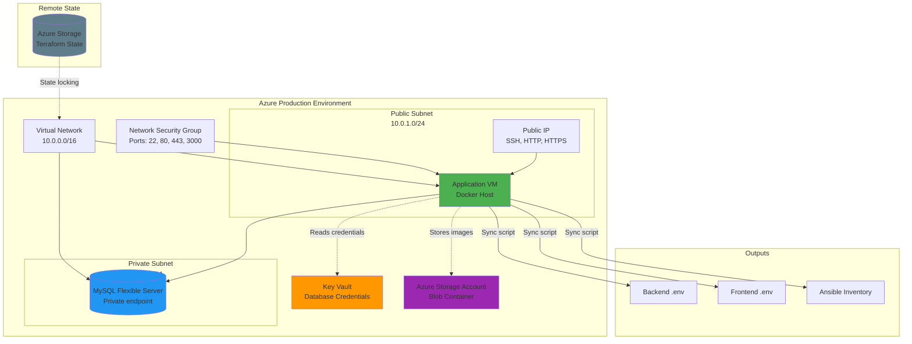

[](https://github.com/javidsegura/url-shortener/actions/workflows/cd-deploy.yml)
[](https://github.com/javidsegura/url-shortener/actions/workflows/ci-frontend.yml)
[](https://github.com/javidsegura/url-shortener/actions/workflows/ci-backend.yml)
[](https://github.com/javidsegura/url-shortener/actions/workflows/ci-infra.yml)


# URL Shortener

A production-ready, enterprise-grade URL shortening service built with FastAPI and React, featuring multi-cloud deployment, comprehensive CI/CD automation, advanced security practices, and full observability.

## Overview

This URL shortener is a fully-featured, production-ready application that provides a scalable solution for creating and managing shortened URLs. The system has evolved from a basic URL shortening service to a comprehensive platform with **multi-cloud resilience** (AWS + Azure), **automated CI/CD pipelines**, **extensive test coverage** (85%+), **security hardening**, and **production monitoring**.

### Key Features

**Core Functionality**
- FastAPI backend with multiple URL shortening strategies (Factory pattern)
- React + TypeScript frontend with modern UI components
- RESTful API with 10+ endpoints supporting full CRUD operations
- Persistent storage using MySQL and cloud storage (S3/Azure Blob)
- Redis caching for performance optimization
- Firebase authentication integration

**DevOps & Infrastructure**
- **Multi-cloud deployment**: Primary production on Azure with AWS staging environment
- **Complete CI/CD pipeline**: Automated testing, security scanning, and deployment
- **Infrastructure as Code**: Terraform for provisioning, Ansible for configuration management
- **Container orchestration**: Docker Compose with health checks and automatic rollback
- **Environment synchronization**: Automated Terraform output injection into application configs
- **Build optimization**: 87.5% faster builds using `uv` package manager with Docker layer caching

**Security**
- Environment variables and GitHub Secrets for credential management
- Pre-commit hooks preventing private key commits
- Static security analysis with Bandit
- Secure random number generation using cryptography library
- Network security groups and private subnets for database isolation
- Two-layer security for monitoring access (SSH tunnel + authentication)

**Testing & Quality**
- **85%+ test coverage** with minimum 70% pipeline requirement
- Unit, integration, regression, smoke, and load tests (k6)
- Health check endpoints (`/ping`, `/dependencies`) for deployment validation
- Pre-commit hooks for formatting, linting, and local test execution
- Fail-fast CI pipeline with tiered testing stages

**Monitoring & Observability**
- Grafana dashboards with Prometheus metrics
- Custom logging with enhanced event metadata
- Health checks integrated into Docker services
- Production telemetry for debugging and performance analysis

**Developer Experience**
- Hot-reload development environment
- SSH tunnel scripts for production debugging
- Modular architecture with clear separation of concerns
- Comprehensive Makefile orchestration
- GitHub Issues for centralized improvement tracking

### Architecture Diagrams

**CI/CD Pipeline Flow**

```mermaid
flowchart TB
    subgraph CI["Continuous Integration (Every Push)"]
        direction TB

        A1[Push to branch] --> B1{Code path<br/>changed?}

        B1 -->|Backend| C1[Stage 1: Fast Checks]
        B1 -->|Frontend| C2[Format Check<br/>Prettier]
        B1 -->|Infra| C3[Terraform Validate<br/>Format Check]

        C1 --> D1[Ruff Lint + Format<br/>Bandit Security Scan]
        D1 -->|✓ Pass| E1[Stage 2: Core Tests]
        D1 -->|✗ Fail| F1[Block merge]

        E1 --> G1[Unit Tests 70%+ coverage<br/>Smoke Tests]
        G1 -->|✓ Pass| H1{PR to main?}
        G1 -->|✗ Fail| F1

        H1 -->|Yes| I1[Stage 3: Heavy Tests]
        H1 -->|No| J1[Complete ✓]

        I1 --> K1[Integration Tests<br/>Regression Tests<br/>Docker Environment]
        K1 -->|✓ Pass| J1
        K1 -->|✗ Fail| F1

        C2 -->|✓ Pass| J1
        C2 -->|✗ Fail| F1
        C3 -->|✓ Pass| J1
        C3 -->|✗ Fail| F1
    end

    subgraph CD["Continuous Delivery (Semantic Version Tag)"]
        direction TB

        A2[Push tag v*.*.* ] --> B2[Detect Changes<br/>git diff vs previous tag]

        B2 --> C4{Infrastructure<br/>changed?}

        C4 -->|Yes| D2[Full Deployment Path<br/>~10 minutes]
        C4 -->|No| E2[App-Only Path<br/>~3 minutes]

        D2 --> F2[Setup: Install deps<br/>Azure auth, secrets]
        E2 --> F2

        F2 --> G2[Create .env files<br/>Inject secrets]

        G2 --> H2{Run Terraform?}

        H2 -->|Yes| I2[Terraform Apply<br/>Provision Azure resources]
        H2 -->|No| J2[Skip Terraform init]

        I2 --> K2[Sync Outputs<br/>Python script]
        J2 --> K2

        K2 --> L2[Inject into:<br/>Backend .env<br/>Frontend .env<br/>Ansible inventory]

        L2 --> M2[Build frontend<br/>npm run build]
        M2 --> N2[Docker build + push<br/>Multi-platform<br/>Tag: env-version]

        N2 --> O2[Ansible Playbook]

        O2 --> P2[Copy files to VM<br/>Pull Docker images<br/>Deploy compose stack]

        P2 --> Q2[Health Check<br/>/api/health/dependencies<br/>3 retries, 30s delay]

        Q2 --> R2{Health OK?}

        R2 -->|Yes| S2[Save tag to file<br/>Deployment complete ✓]
        R2 -->|No| T2[Read previous tag<br/>Capture Docker logs]

        T2 --> U2[Rollback deploy<br/>Previous version]
        U2 --> V2[Fail pipeline ✗<br/>Show logs]
    end

    J1 -.->|Tag on main| A2

    style F1 fill:#f8d7da
    style J1 fill:#d4edda
    style S2 fill:#d4edda
    style V2 fill:#f8d7da
    style C1 fill:#fff3cd
    style E1 fill:#cfe2ff
    style I1 fill:#d1e7dd
    style D2 fill:#e1f5ff
    style E2 fill:#fff4e1
    style O2 fill:#d4edda
```


**Azure Production Architecture**


**Additional Architecture Resources**
- [AWS Architecture Diagram](media/cloud-arch/aws.png)
- [Full CI/CD Pipeline Diagram](media/ci-cd/full-pipeline.mmd)
- [Azure Architecture Diagram](media/cloud-arch/azure.mmd)
- [Deployment Architecture](media/Deployment%20Architecture.drawio.png)
- [Project Reports](media/reports/)

## See extended documentation here
[Extended documentation](https://deepwiki.com/javidsegura/url-shortener/2.2-local-development-setup)


## Step-by-Step Installation
### 0. Clone this repo (you may need to fork it otherwise)
```bash
git clone https://github.com/javidsegura/url-shortener.git
```

### 1. Environment Variable Setup
Before installing, set the **ENVIRONMENT** variable:
```bash
export ENVIRONMENT=dev # or 'staging' or 'production'
export CLOUD_PROVIDER=aws  # OR 'azure'
````

This is validated by `Makefile:86-91` which exits with an error if **ENVIRONMENT** is undefined.

-----

### 2\. Install All Dependencies

#### Prerequistes
      - Python 3.11
      - Docker and Docker Compose
      - Node.js and npm
      - Terraform and ansible
      - UV: "[how to install"](https://docs.astral.sh/uv/#installation)
      - K6: "[how to install"](https://grafana.com/docs/k6/latest/set-up/install-k6/)

#### Other dependencies

From the repository root:

```bash
make install
```

This command:

  * Validates the **ENVIRONMENT** variable
  * Installs backend dependencies: `make -C backend install`
  * Installs frontend dependencies: `make -C frontend install`
  * Installs infrastructure tools: `make -C infra install`
  * Installs **jq** via Homebrew for JSON processing

-----

### 3\. Package-Only Installation (Alternative)

To install only application packages without infrastructure tooling:

```bash
make install-packages
```

This skips infrastructure tools and only installs backend and frontend packages.

-----

## Backend-Specific Installation

The backend uses Python's `pyproject.toml` with setuptools. Installation modes:

| Command | Installs | Use Case |
| :--- | :--- | :--- |
| `pip install -e .` | Runtime dependencies only | Production deployment |
| `pip install -e .[dev]` | Runtime + dev tools | Local development |
| `pip install -e .[tests]` | Runtime + test tools | CI/CD pipelines |
| `pip install -e .[dev,tests]` | All dependencies | Complete local setup |

The `-e` flag installs in editable mode, allowing code changes without reinstallation. The package source is located in `src/` as specified by `backend/pyproject.toml:52-53`.


## Local dev set-up
### 0. Generate remote infra state
#### 1. Create infra/terraform/set-up/terraform.tfvars and write
project_name = "url-shortener"
#### 2. Generate remote state
```bash
make -C infra start-remote-state
```
### 1. Set up environmental variables
Before installing, set the **ENVIRONMENT** variable:
```bash
      export ENVIRONMENT=dev
```
### 2. Generate `.env` Templates
You'll need to create and populate `.env` files for both the backend and frontend services.

### Backend

1. Navigate to the directory `backend/env_config/base` (create if not present).
1.5. You will need to create `env_config` and `/base` and `/synced` inside it

2. Create a new file named `.env.dev` (check the .env.dev.example or the other .env.*.example).

3. Add the following variables to the file. You must set these to actual values before running the application, but for now, they are set to **empty strings** as placeholders.
      ```bash
      # SET-UP
      ENVIRONMENT="dev"

      # REDIS
      REDIS_URL="redis://redis:6379"

      # DB
      MYSQL_USER=""
      MYSQL_PASSWORD=""
      MYSQL_HOST="database"
      MYSQL_PORT="3306"
      MYSQL_DATABASE="url_shortener"
      MYSQL_SYNC_DRIVER="mysql+pymysql"
      MYSQL_ASYNC_DRIVER="mysql+aiomysql"


      # 4) CLOUD
      CLOUD_PROVIDER=""

      # AWS
      AWS_ACCESS_KEY_ID=""
      AWS_SECRET_ACCESS_KEY=""
      AWS_MAIN_REGION=""

      # AZURE
      AZURE_STORAGE_ACCOUNT_NAME=""
      AZURE_STORAGE_ACCOUNT_KEY=""

      ## TERRAFORM OUTPUTS:
      ```
4. Navigate to `src/url_shortener/core/clients/`
5. Create file titled `secret.url-shortener-abadb-firebase-adminsdk-fbsvc-48d38c91f0.json` and fill in with your firebase credentials

### Frontend

1. Go to the frontend directory: `frontend/app/env_config/base`. \
1.5. You will need to create `env_config` and `/base` and `/synced` inside it

2. Create a new file named `.env.dev` (also create those for other stages: `.env.production` and `.env.staging` if not present).

3. **Note:** The file must exist at this path, but for the initial setup, you **do not need to fill in any environmental variables** inside it.

### Infra
1. Go to infra file: `infra/terraform/{cloud_provider}/environment/{environment}/terraform.tfvars`  (create if not existent)
2. Fill in the variables defined in  `infra/terraform/{cloud_provider}/environment/{environment}/variables.tf`

### 3. Start app locally
```bash

# For all of these commands you need the docker daemon to be running in the background!
make dev-start # Starts the entire local dev environment
make dev-stop # Kills the entire local dev environment
make dev-restart-docker-compose # Useful for debugging backend/frontend with hot reloading
make dev-start-infra # Start infra for dev
make # Help comand explaining all make tasks
```

### 4. Run tests with:
```bash
# 1)
cd backend

# 2)
make test-start: ## Stats docker compose for integration tests
make test-stop: ## Stops docker compose for integration tests of endpoints
make unit-test: ## Run all unit tests with coverage
make integration-test: ## Runn all integration tests
make regression-test: ## Run all regression tests
make smoke-test: ## Run all smoke endpoint tests
make load-tests: ## Run load tests with k6
```
## Production set-up
### For Automatic Deployment use the CI/CD (create a tag for automatic deployment)
### For manual deployment
#### 1) Set-up environmental variables
Fill up .env.production.example
#### 2) Do az login in the command
#### 3) Run `deploy-start` or `deploy-start-with-infra` wether you need the infra deployed as well


# ENTIRE TECH STACK
Based on the codebase analysis, here is the tech stack used in the URL shortener project:

## Backend
- **Python** (>=3.8) [1](#1-0)
- **FastAPI** (web framework) [2](#1-1)
- **Uvicorn** (ASGI server) [3](#1-2)
- **Gunicorn** (production server) [4](#1-3)
- **Pydantic** (data validation) [5](#1-4)
- **SQLAlchemy** (ORM with async support) [6](#1-5)
- **MySQL** (database) [7](#1-6)
- **Redis** (caching) [8](#1-7)
- **Alembic** (database migrations) [9](#1-8)
- **Firebase Admin** (authentication) [10](#1-9)
- **Boto3** (AWS SDK) [11](#1-10)

## Frontend
- **React** (19.1.1) [12](#1-11)
- **TypeScript** [13](#1-12)
- **Vite** (build tool) [14](#1-13)
- **React Router DOM** (routing) [15](#1-14)
- **Tailwind CSS** (styling) [16](#1-15)
- **Firebase** (client SDK) [17](#1-16)
- **Radix UI** (component library) [18](#1-17)
- **Lucide React** (icons) [19](#1-18)

## Infrastructure & DevOps
- **Docker** & **Docker Compose** [20](#1-19)
- **Nginx** (reverse proxy) [21](#1-20)
- **Terraform** (infrastructure as code) [22](#1-21)
- **Ansible** (configuration management) [23](#1-22)
- **AWS** (cloud provider - RDS for database)

## Testing & Development Tools
- **Pytest** (backend testing) [24](#1-23)
- **ESLint** (frontend linting) [25](#1-24)
- **Ruff** (Python linting/formatting) [26](#1-25)
- **Pre-commit** (git hooks) [27](#1-26)


### Citations

**File:** backend/pyproject.toml (L4-4)
```text
requires-python = ">=3.8"
```

**File:** backend/pyproject.toml (L6-6)
```text
      "fastapi",
```

**File:** backend/pyproject.toml (L7-7)
```text
      "uvicorn",
```

**File:** backend/pyproject.toml (L8-8)
```text
      "gunicorn",
```

**File:** backend/pyproject.toml (L9-9)
```text
      "pydantic",
```

**File:** backend/pyproject.toml (L10-10)
```text
      "redis",
```

**File:** backend/pyproject.toml (L13-13)
```text
      "sqlalchemy[asyncio]",
```

**File:** backend/pyproject.toml (L17-17)
```text
      "firebase-admin",
```

**File:** backend/pyproject.toml (L18-18)
```text
      "boto3",
```

**File:** backend/pyproject.toml (L19-19)
```text
      "alembic"
```

**File:** backend/pyproject.toml (L24-24)
```text
      "ruff",
```

**File:** backend/pyproject.toml (L26-26)
```text
      "pre-commit",
```

**File:** backend/pyproject.toml (L29-29)
```text
      "ansible-core",
```

**File:** backend/pyproject.toml (L37-37)
```text
      "pytest",
```

**File:** docker-compose.dev.yml (L39-39)
```yaml
    image: mysql:8.0
```

**File:** frontend/app/package.json (L14-14)
```json
    "@radix-ui/react-avatar": "^1.1.10",
```

**File:** frontend/app/package.json (L17-17)
```json
    "firebase": "^12.2.0",
```

**File:** frontend/app/package.json (L18-18)
```json
    "lucide-react": "^0.542.0",
```

**File:** frontend/app/package.json (L19-19)
```json
    "react": "^19.1.1",
```

**File:** frontend/app/package.json (L21-21)
```json
    "react-router-dom": "^7.8.2",
```

**File:** frontend/app/package.json (L32-32)
```json
    "eslint": "^9.33.0",
```

**File:** frontend/app/package.json (L37-37)
```json
    "tailwindcss": "^4.1.12",
```

**File:** frontend/app/package.json (L39-39)
```json
    "typescript": "~5.8.3",
```

**File:** frontend/app/package.json (L41-41)
```json
    "vite": "^7.1.2"
```

**File:** docker-compose.yml (L1-2)
```yaml
# Nginx server (added later), redis, db (added later)
services:
```

**File:** docker-compose.yml (L35-36)
```yaml
  nginx:
    image: nginx:alpine
```

**File:** infra/terraform/modules/rds (L1-1)
```text
[{"name":"main.tf","path":"infra/terraform/modules/rds/main.tf","sha":"5391855792610e98dbc30196c23b4163a3a2936f","size":1156,"url":"https://api.github.com/repos/javidsegura/url-shortener/contents/infra/terraform/modules/rds/main.tf?ref=main","html_url":"https://github.com/javidsegura/url-shortener/blob/main/infra/terraform/modules/rds/main.tf","git_url":"https://api.github.com/repos/javidsegura/url-shortener/git/blobs/5391855792610e98dbc30196c23b4163a3a2936f","download_url":"https://raw.githubusercontent.com/javidsegura/url-shortener/main/infra/terraform/modules/rds/main.tf","type":"file","_links":{"self":"https://api.github.com/repos/javidsegura/url-shortener/contents/infra/terraform/modules/rds/main.tf?ref=main","git":"https://api.github.com/repos/javidsegura/url-shortener/git/blobs/5391855792610e98dbc30196c23b4163a3a2936f","html":"https://github.com/javidsegura/url-shortener/blob/main/infra/terraform/modules/rds/main.tf"}},{"name":"outputs.tf","path":"infra/terraform/modules/rds/outputs.tf","sha":"335187c8f2bb2972083c43a4f925245aba6a2e88","size":279,"url":"https://api.github.com/repos/javidsegura/url-shortener/contents/infra/terraform/modules/rds/outputs.tf?ref=main","html_url":"https://github.com/javidsegura/url-shortener/blob/main/infra/terraform/modules/rds/outputs.tf","git_url":"https://api.github.com/repos/javidsegura/url-shortener/git/blobs/335187c8f2bb2972083c43a4f925245aba6a2e88","download_url":"https://raw.githubusercontent.com/javidsegura/url-shortener/main/infra/terraform/modules/rds/outputs.tf","type":"file","_links":{"self":"https://api.github.com/repos/javidsegura/url-shortener/contents/infra/terraform/modules/rds/outputs.tf?ref=main","git":"https://api.github.com/repos/javidsegura/url-shortener/git/blobs/335187c8f2bb2972083c43a4f925245aba6a2e88","html":"https://github.com/javidsegura/url-shortener/blob/main/infra/terraform/modules/rds/outputs.tf"}},{"name":"variables.tf","path":"infra/terraform/modules/rds/variables.tf","sha":"d8bbae5797386c6616e2093b2abc23cddb93d6bd","size":192,"url":"https://api.github.com/repos/javidsegura/url-shortener/contents/infra/terraform/modules/rds/variables.tf?ref=main","html_url":"https://github.com/javidsegura/url-shortener/blob/main/infra/terraform/modules/rds/variables.tf","git_url":"https://api.github.com/repos/javidsegura/url-shortener/git/blobs/d8bbae5797386c6616e2093b2abc23cddb93d6bd","download_url":"https://raw.githubusercontent.com/javidsegura/url-shortener/main/infra/terraform/modules/rds/variables.tf","type":"file","_links":{"self":"https://api.github.com/repos/javidsegura/url-shortener/contents/infra/terraform/modules/rds/variables.tf?ref=main","git":"https://api.github.com/repos/javidsegura/url-shortener/git/blobs/d8bbae5797386c6616e2093b2abc23cddb93d6bd","html":"https://github.com/javidsegura/url-shortener/blob/main/infra/terraform/modules/rds/variables.tf"}}]
```
