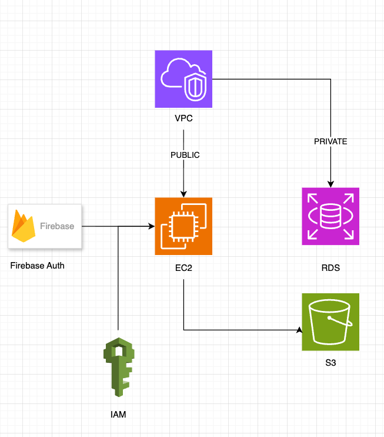
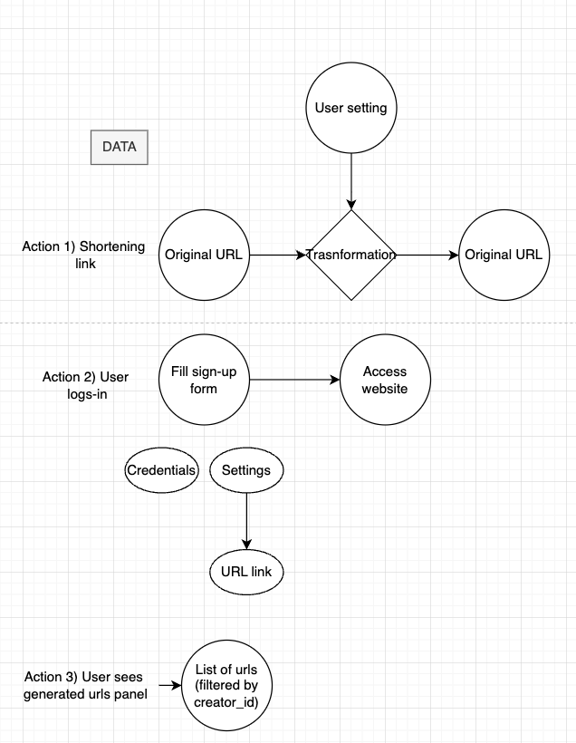

# Requirements & Constraints
## Requirements
### Business Requirements
- Purpose: User provides a url, app spits out a shareable shortened link
- Performance requirements: 1 user daily, 200ms response times
- Security requirements: not-compliant
- Budget constraints: <$5/monthly
- Scalibility needs Handle 100 users concurrently 
- Geographic requirements: Spain only customer base
### Technical Requirements
- Application architecture: monolothic. Docker compose with reverse nginx, redis, backend in a single docker compose
- Data storage: key-value for redis (url shortened), sql for user data
- Backup, disaster recovery: RDS daily snapshots
- Dev environments: local development (with hot reloading), production in the cloud
- Oauth with firebase

### AWS SERVICES
- S3 for user profile pics 
- EC2 for docker compose
      - AMI
- RDS
- VPC 
- No ElasticCache (we will use docker container for a cheaper approach)
- IAM => roles + dev user (for terraform)

### App architecture

### Data flow

### Critical Risks
- Technical risks
  - Too much stress (all the load) into a single app instance
  - No vertical scaling
  - IaC is AWS-specific
- Security risks
  - Data breaches => avoided, we use RDS in private subnet
  - Authentication flawys => avoided, we use robust 3rd party Firebase
  - DDOS attack => using default AWS-shield
  - Vulnerable dependencies => using inspectors in CI for source + 3rd party reviewers
- Business risks
  - Lack of disaster recovery
  - No compliance with GDPR

## thins to rembemver
- Disallow backend docs from public app!